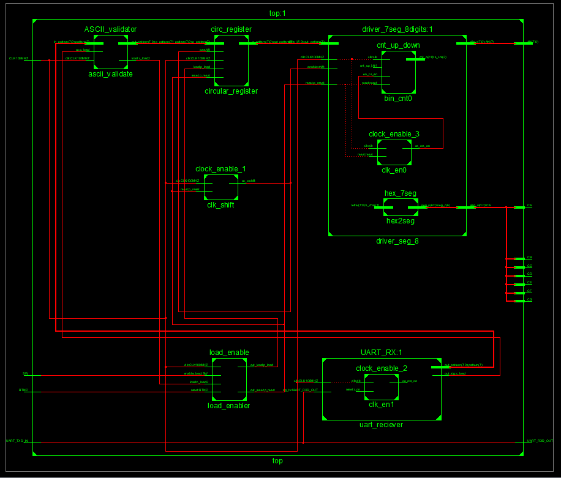

# Running text on 7-seg displays (after consultation modified to LCD display)

### Team members

* Hana DAOVÁ, 230238 (responsible for xxx)
* Tomáš UCHYTIL, 230337 (responsible for LCD driver)
* David ZIMNIOK, 230354 (responsible for comunication with PC and data register)

### Table of contents

* [Project objectives](#objectives)
* [Hardware description](#hardware)
* [VHDL modules description and simulations](#modules)
* [TOP module description and simulations](#top)
* [Video](#video)
* [References](#references)

## Project objectives

Write your text here.

## Hardware description

Write your text here.

## VHDL modules description and simulations

Write your text here.

## TOP module description and simulations

Top module was divided to two parts. First part is responsible for data storing to register from serial input and for shifting register operations. At the output of this module are 8 bits representing ASCII character. Second part is responsible for comunication with LCD driver (Hitachi HD44780 or simillar). 

### Part of top responsible for data operations

This part was created from module of circular register (responsible for storing data), UART_RX module (responsible for comunication with computer via RS232 line) - this module have own clock divider set to speed 115200 bauds, clock_enable module (clock for shifting register defining when rester shifts data to left) and load_enable module (responsible for elimination of unwanted states as reset during loading data). For more information about function of these modules please see [VHDL modules description and simulations](#modules). In this caption you also can find source codes and simulations of each modules.  

**Connection diagram**

**Loading data without enabling it by hardware switch**

note: If you don't enable loading data are not stored to the register. This is secured by load_enable module. In this mode reset is passed to the reset inputs of each modules. 

**Loading data with enabling it by hardware switch**

note: After enabling data storing data at serial input are loaded to the register. When this switch is in the on position all reset signals are supressed. At the out pattern from register is the first ASCII char and shifting of the register is not interupted. For loading data this is not problem because counter of bit index is not connected with shifting. Before loading data for loading from zero position is recomended reset of circuit, but this is provided by load_enabler. 

**Reseting the circuit**

note: When reset is pressed and load mode is disabled, all registers (memory) is set to the ASCII char of white space. 

**Complete function of the circuit**

note: After storing the data to the register data are shifted on the output pattern controlled by ce signal from clock_enable module every 500ms.

## Video

Write your text here

## References

1. Write your text here.