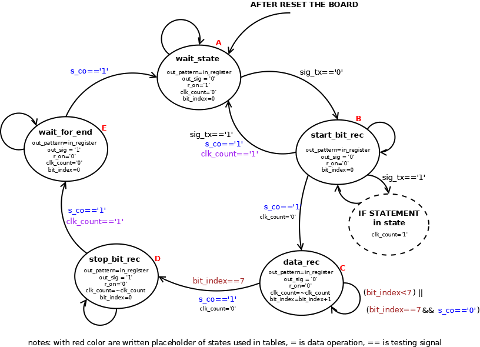
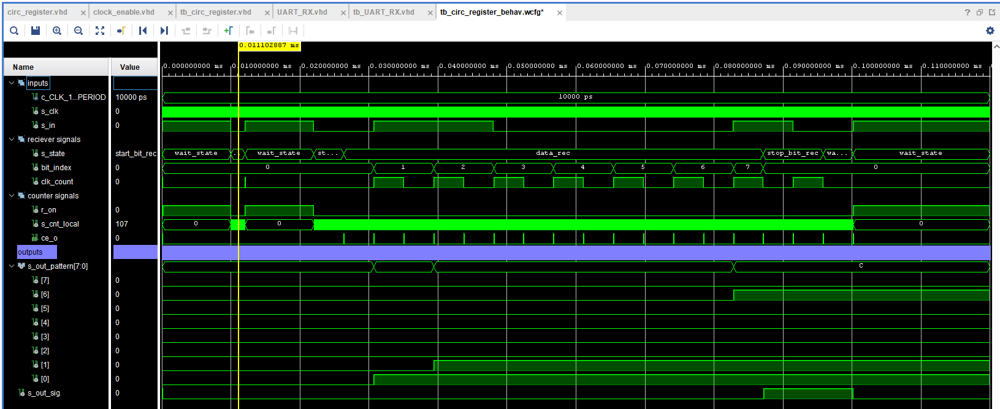
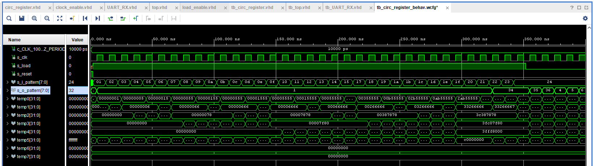
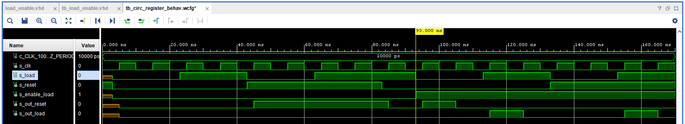

# Running text on 7-seg displays

### Team members

* Hana DAOVÁ, 230238 (responsible for technical documentation)
* Tomáš UCHYTIL, 230337 (responsible for 7-segment display driver)
* David ZIMNIOK, 230354 (responsible for communication with PC and data register)

### Table of contents

* [Project objectives](#objectives)
* [Hardware description](#hardware)
* [VHDL modules description and simulations](#modules)
* [TOP module description and simulations](#top)
* [Video](#video)
* [References](#references)

## Project objectives

Write your text here.

## Hardware description

Write your text here.

## VHDL modules description and simulations

### UART RX module

This module is responsible for communication with computer via serial line. For this purposes we can use implemented UART module in FPGA board. This option uses UART bridge between standard USB connector which is used as power supply but also as a programmer. This option needs installed special driver at computer to translate UART packages to readable format for USB bridge on board.
The communication is defined by standard RS-232. For our application we set baudrate to 9600. Communication is divided to 3 phases in simplier version. First comes the start bit defined as voltage drop from logical 1 to logical 0. If there is no communication on the bus, logical 1 is on. The next bits come in as 8 bits of data coded to ASCII format from computer. The whole communication is terminated by sending stop bit - change from logical 0 to logical 1.
Because this communication is periodical and only transmitted data are different, the best soulution is to implement finite state machine. We used reference number 1 as inspiration and we have implemented clock enable mode instead of counting in every state. This is the best solution according to us since we have 1 module used more times in one project. 

[Source code for UART_RX module](src/UART_RX.vhd)        

[Source code for UART_RX module simulation](tb/tb_UART_RX.vhd)

#### Table with states for FSM
| placeholder | name of state | description                               |
|-------------|---------------|-------------------------------------------|
| A           | wait_state    | waiting for start bit                     |
| B           | start_bit_rec | verify start bit                          |
| C           | data_rec      | recieving data repeat 8 times (bit index) |
| D           | stop_bit_rec  | recieve stop bit                          |
| E           | wait_for_end  | wait for half of period of baudrate       |

We have defined five states. What happens in every state is described in the table. Verification and sampling each data bit is done in half of the period of baud rate.

#### Transition table for FSM
| **INPUT VARIABLE** |    |    |    |    |    |    |    |    |    |    |    |    |    |    |    |    |
|--------------------|----|----|----|----|----|----|----|----|----|----|----|----|----|----|----|----|
| sig_tx             | 0  | 1  | 0  | 1  | 0  | 1  | 0  | 1  | 0  | 1  | 0  | 1  | 0  | 1  | 0  | 1  |
| s_co               | 0  | 0  | 1  | 1  | 0  | 0  | 1  | 1  | 0  | 0  | 1  | 1  | 0  | 0  | 1  | 1  |
| clk_count          | 0  | 0  | 0  | 0  | 1  | 1  | 1  | 1  | 0  | 0  | 0  | 0  | 1  | 1  | 1  | 1  |
| bit_index          | <7 | <7 | <7 | <7 | <7 | <7 | <7 | <7 | =7 | =7 | =7 | =7 | =7 | =7 | =7 | =7 |
| **STATE**          |    |    |    |    |    |    |    |    |    |    |    |    |    |    |    |    |
| A                  | B  | A  | B  | A  | B  | A  | B  | A  | B  | A  | B  | A  | B  | A  | B  | A  |
| B                  | B  | B  | C  | B  | B  | B  | C  | A  | B  | B  | C  | B  | B  | B  | C  | A  |
| C                  | C  | C  | C  | C  | C  | C  | C  | C  | C  | C  | D  | D  | C  | C  | D  | D  |
| D                  | D  | D  | D  | D  | D  | D  | E  | E  | D  | D  | D  | D  | D  | D  | E  | E  |
| E                  | E  | E  | A  | A  | E  | E  | A  | A  | E  | E  | A  | A  | E  | E  | A  | A  |

#### Output variables and internal signal changes for FSM
| state\out var | out_pattern | out_sig | r_on | clk_count  | bit_index   | note                                                                      |
|---------------|-------------|---------|------|------------|-------------|---------------------------------------------------------------------------|
| wait_state    | in_reg      | 0       | 1    | 0          | 0           |                                                                           |
| start_bit_rec | in_reg      | 0       | 0    | ~clk_count | 0           | at transition clk_count is set to 0 and inversion is set only if sig_tx=1 |
| data_rec      | in_reg      | 0       | 0    | ~clk_count | bit_index+1 | at transition clk_count is set to 0                                       |
| stop_bit_rec  | in_reg      | 1       | 0    | ~clk_count | 0           |                                                                           |
| wait_for_end  | in_reg      | 1       | 0    | x          | 0           |                                                                           |

Signal named as out_patter is 8bit output of recieved data. Data in this register are changed continuosly, and their validity are signalized by out_sig signal. Clk_count signal is a one bit counter and at everytransition is set to zero. Bit_index variable is integer in range from 0 to 7 and points to actual position of recieved data. R_on signal starts local timer to count - frequency is half of baudrate.

#### Transition diagram for FSM

#### Recieve non valid start bit (is shorter than excepted)

note: this situation can happend if there is some noise on serial bus or when we set wrong baud rate

#### Recieve 1 valid ASCII character with changing states

note: this simulation shows exact function of each state

#### Recieve 4 valid ASCII characters

note: this simulation shows function of recieving string (more than 1 character in one transmission)

#### Unconnected cable (logical 0 at input - continuously) and its connection

note: this simulation shows what happend if we have continuously logical 0 at input which means that RS232 cable is unconnected, and what happend if we connect out device to the bus and set logical 1 from transimtter to indicate calm state and ready to comunicate with reciever

### Circular register module
    
This module connects 8 simple PISO registers. Each register is used for one bit weight. When we initialize this circuit all registers are filled with zeros and register at position 5 is filled with 1's. This is ASCII code of white space. Reseting of module have similar effect. While loading data to registers we load simulateously to 8 register always to same position. Ater store data position index is incremented. For rotating register we use VHDL command 'ror'. This command rotate register to right. So data from 0 position will be in at position 31 (for 32 bits register).

[Source code for circular register module](src/circ_register.vhd)        

[Source code for circular register module simulation](tb/tb_circ_register.vhd)

#### Principial scheme of PISO register (1 bit weight)
 

#### Normal function of register
   
note: While loading value is chaged from 01hex to 22hex. This is caused by owerflow of bit index counter. So if we load more than 32 bits register starts overwriting oldest data. Reseting of module cause loading whitespace ASCII value to all registers.

#### Detail of loading data to the register
   
note: Loaded data are numbers from 0 to 36. When signal 'load' goes to logical 0 register starts shifting.                 

#### Detail of shifting data on the register
     
    
### Clock enable module

Module used from computer excercises. This module simply counts up rising edges of clock signal, and when we reach number set by generic constant (could be changed from top module), circuit generates one clock long impulse which is used in another circuits for short enabling function for one clock periode. So we don't need any clock divider but we generate short pulses after x clocks periods. 

[Source code for clock_enable module](src/clock_enable.vhd)        

[Source code for clock_enable module simulation](tb/tb_clock_enable.vhd)

#### Simulation of clock enable module used in top module (periode is 0,5s)

note: when reset is in high local counter is set to zero and whole function of circuit is deactivated till to reset will be low

### Load enable module

Simple sequentional circuit which we can descibe via truth table.

[Source code for load_enable module](src/load_enable.vhd)        

[Source code for load_enable module simulation](tb/tb_load_enable.vhd)

#### Truth table

| clk                             | reset | load | last_load | enable_load | last_en | out_reset | out_load |
|---------------------------------|-------|------|-----------|-------------|---------|-----------|----------|
|  |   0   |   x  |     x     |      x      |    x    |     0     |     0    |
|  |   1   |   x  |     x     |      x      |    x    |     1     |     0    |
|  |   x   |   1  |     0     |      1      |    0    |     1     |     1    |
|  |   x   |   1  |     0     |      1      |    1    |     0     |     1    |
|  |   x   |   x  |     x     |      1      |    0    |     1     |     0    |
|  |   x   |   x  |     x     |      1      |    1    |     0     |     0    |

#### Simulation of work
 
note: another states are impossible due to output combinations and another circuits combinational logics

## TOP module description and simulations

Top module was divided to two parts. First part is responsible for data storing to register from serial input and for shifting register operations. At the output of this module are 8 bits representing ASCII character. Second part is responsible for comunication with 7segment display.

[Source code for top module](src/top.vhd)

### Part of top responsible for data operations

This part was created from module of circular register (responsible for storing data), UART_RX module (responsible for comunication with computer via RS232 line) - this module have own clock divider set to speed 115200 bauds, clock_enable module (clock for shifting register defining when rester shifts data to left) and load_enable module (responsible for elimination of unwanted states as reset during loading data). For more information about function of these modules please see [VHDL modules description and simulations](#modules). In this caption you also can find source codes and simulations of each modules.  

[Source code for simulations below](tb/tb_top.vhd)

#### Loading data without enabling it by hardware switch

note: If you don't enable loading data are not stored to the register. This is secured by load_enable module. In this mode reset is passed to the reset inputs of each modules. 

#### Loading data with enabling it by hardware switch

note: After enabling data storing data at serial input are loaded to the register. When this switch is in the on position all reset signals are supressed. At the out pattern from register is the first ASCII char and shifting of the register is not interupted. For loading data this is not problem because counter of bit index is not connected with shifting. Before loading data for loading from zero position is recomended reset of circuit, but this is provided by load_enabler. 

#### Reseting the circuit

note: When reset is pressed and load mode is disabled, all registers (memory) is set to the ASCII char of white space. 

#### Complete function of the circuit

note: After storing the data to the register data are shifted on the output pattern controlled by ce signal from clock_enable module every 500ms.

## Video

Write your text here

## References

1. Merrick, R. (2018, December 22). UART, serial port, RS-232 interface. UART in VHDL and Verilog for an FPGA. Retrieved April 18, 2022, from [https://www.nandland.com/vhdl/modules/module-uart-serial-port-rs232.html](https://www.nandland.com/vhdl/modules/module-uart-serial-port-rs232.html) 
2. Frýza, T. (2018). Template for 7-segment display decoder. 7-segment display decoder. Retrieved April 18, 2022, from [https://www.edaplayground.com/x/Vdpu](https://www.edaplayground.com/x/Vdpu) 
3. Wikimedia Foundation. (2022, February 14). RS-232. Wikipedia. Retrieved April 18, 2022, from [https://en.wikipedia.org/wiki/RS-232](https://en.wikipedia.org/wiki/RS-232)
4. Letterising the Seven Segment Display – fyr.io. (2018, March 8). Fyr.Io. Retrieved April 19, 2022, from [https://fyr.io/2018/03/08/letterising-the-seven-segment-display](https://fyr.io/2018/03/08/letterising-the-seven-segment-display/)
